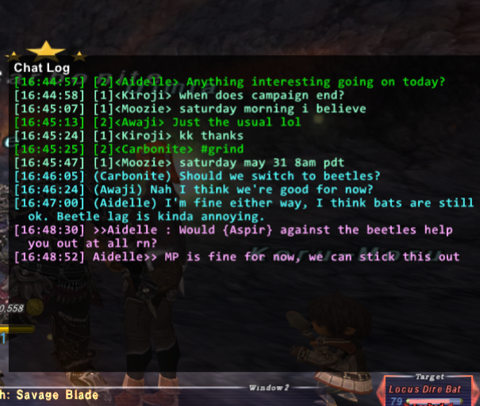

# LSC: A Personal Chat Monitor for Windower4 and FFXI

### Overview

LSC (short for "linkshell chat") was originally created out of a desire to know what's been happening in LS while afk. This eventually expanded to cover the other main social chat types: linkshell, linkshell2, party, and tell.

LSC will show the most recent 20 or so lines of chat from all tracked modes in a panel on the lower-right section of your screen. This window can be hidden (see the `hide` command under usage below), in which case messages will still be tracked for later review.

LSC also provides a mechanism to review all received messages via the `replay` command (see below), so you'll never miss anything.

### Installation

Drop the `lsc` folder into your Windower4/addons directory and run `//lua r lsc`. To unload the addon, run `//lua u lsc`.

LSC can be added to your `init.txt` file to have it autoloaded at startup. Add `lua load lsc` near the end of the file if you'd like it to start with Windower.

**The latest release is available [here](https://github.com/Kaiconure/lsc/releases/).**

### Usage

LSC supports a handful of commands to help you get them most out of the addon.  Commands are sent to LSC by typing `//lsc <command> <arguments>` into the FFXI chat window.

- **show** - Shows the UI panel if it's currently hidden. Run as `//lsc show`.

- **hide** - Hides the UI pannel if it's currently being shown. Run as `//lsc hide`.

- **replay** [-type all|linkshell|linkshell2|party|tell>] [-max &lt;number&gt;] - Writes chat history out to the FFXI chat window for review.

- - **type** - Used to control the types of messages to list. If not specified, `all` is used. Shortcuts are support: `l` or `ls` for `linkshell`, `l2` or `ls2` for `linkshell2`, `p` for party, and `t` for tell.
  
  - **max** - The maximum number of messages to show. If not specified, the most recent 10 messages of your specified type will be displayed.

- <mark>NEW</mark> **clear** [-d] - Clears the chat log (that is, what's shown when running `//lsc replay` and its variants). If you specify the `-display` (or `-d` shortcut), then the on-screen chat display will also be cleared.

- **help** - Shows an in-game variation of these help notes.

Additional commands will be made available in a later version.

### Known Issues

- Japanese text is not properly captured. I need to do a better job of stripping out control characters while not stripping out non-ANSI text.

- There are no configuration options. The chat window size and position is fixed, it won't remember if it was shown or hidden, fonts, font size, color are hard-coded, and so on. I'll prioritize and address these as we go.

## Attribution

- [cylibs-ui by cyritegamestudios](https://github.com/cyritegamestudios/cylibs-ui) - LSC uses cylibs-ui for rendering its on-screen components.
